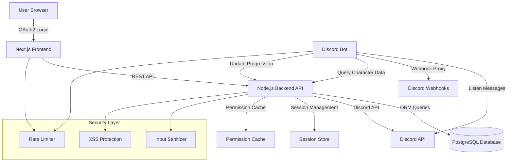

# Design Document: RP Manager System

## Overview

The RP Manager System is a comprehensive Discord roleplay management platform consisting of a web dashboard and Discord bot that enables users to create and manage roleplay characters with webhook-based message proxying. The system provides server-scoped character management, permission-based access control, and an automated progression system with rank promotions. Built with Next.js/React frontend and TypeScript backend, it integrates deeply with Discord's OAuth2 and Webhook APIs to deliver a seamless roleplay experience while maintaining strict security and rate limiting controls.

The architecture follows a three-tier model: a React/Next.js frontend with Tailwind CSS (blue, purple, white, black color scheme), a Node.js/TypeScript backend API with Prisma ORM, and PostgreSQL database. The Discord bot monitors messages, triggers webhook proxying based on character brackets, tracks progression metrics, and announces promotions via rich embeds on configured channels.

## Architecture



## Main Workflow: Message Proxying

```mermaid
sequenceDiagram
    participant U as User
    participant D as Discord
    participant B as Bot
    participant API as Backend API
    participant DB as Database
    participant W as Webhook
    
    U->>D: Send message with brackets [text]
    D->>B: Message event
    B->>B: Parse brackets
    B->>API: GET /characters/by-bracket
    API->>DB: Query character
    DB-->>API: Character data
    API-->>B: Character found
    B->>D: Delete original message
    B->>W: Create webhook message
    W->>D: Post as character
    B->>API: POST /progression/increment
    API->>DB: Update message count
    DB-->>API: Check promotion trigger
    API-->>B: Promotion triggered
    B->>D: Send promotion embed

## Components and Interfaces

### Component 1: Frontend Dashboard (Next.js/React)

**Purpose**: Provides web interface for character management, progression tracking, and server configuration

**Interface**:
```typescript
interface DashboardProps {
  user: DiscordUser
  guilds: Guild[]
  selectedGuild: string | null
}

interface CharacterFormProps {
  guildId: string
  character?: Character
  onSubmit: (data: CharacterInput) => Promise<void>
  onCancel: () => void
}

interface ProgressionPanelProps {
  character: Character
  ranks: Rank[]
  currentRank: Rank
  nextRank: Rank | null
  progress: ProgressionMetrics
}
```

**Responsibilities**:
- OAuth2 Discord authentication flow
- Character CRUD operations with form validation
- Real-time progression display
- Server selection and configuration
- Futuristic UI with blue/purple/white/black theme
- Client-side input sanitization and validation

### Component 2: Backend API (Node.js/TypeScript)

**Purpose**: REST API handling business logic, database operations, and Discord API integration

**Interface**:
```typescript
interface APIServer {
  // Authentication
  login(code: string): Promise<SessionToken>
  logout(token: string): Promise<void>
  validateSession(token: string): Promise<User>
  
  // Character Management
  createCharacter(data: CharacterInput, userId: string, guildId: string): Promise<Character>
  updateCharacter(id: string, data: Partial<CharacterInput>, userId: string): Promise<Character>
  deleteCharacter(id: string, userId: string): Promise<void>
  getCharacters(guildId: string, userId: string): Promise<Character[]>
  getCharacterByBracket(guildId: string, bracket: string, content: string): Promise<Character | null>
  
  // Permissions
  checkPermissions(userId: string, guildId: string): Promise<GuildPermissions>
  hasStaffOverride(userId: string, guildId: string): Promise<boolean>
  
  // Progression
  incrementMessageCount(characterId: string): Promise<ProgressionResult>
  promoteCharacter(characterId: string, rankId: string, manual: boolean): Promise<Promotion>
  getRanks(guildId: string): Promise<Rank[]>
  
  // Configuration
  updateGuildConfig(guildId: string, config: GuildConfig): Promise<void>
}
```

**Responsibilities**:
- Session management with secure tokens
- Permission validation (owner + staff override)
- Database operations via Prisma ORM
- Input sanitization and XSS prevention
- Rate limiting enforcement
- Discord API permission caching

### Component 3: Discord Bot (Discord.js/TypeScript)

**Purpose**: Monitors Discord messages, triggers webhook proxying, and manages progression automation

**Interface**:
```typescript
interface DiscordBotClient {
  // Message Handling
  onMessage(message: Message): Promise<void>
  parseMessageBrackets(content: string): BracketMatch | null
  proxyMessage(character: Character, content: string, channel: TextChannel): Promise<void>
  
  // Webhook Management
  getOrCreateWebhook(channel: TextChannel): Promise<Webhook>
  sendWebhookMessage(webhook: Webhook, character: Character, content: string): Promise<void>
  
  // Progression
  handlePromotion(promotion: Promotion, guildId: string): Promise<void>
  sendPromotionEmbed(channel: TextChannel, promotion: Promotion): Promise<void>
  
  // Utilities
  deleteMessage(message: Message): Promise<void>
  checkRateLimit(): boolean
}
```

**Responsibilities**:
- Listen to message events across all guilds
- Parse bracket syntax and match characters
- Delete original messages and proxy via webhooks
- Track message counts for progression
- Send rich embed announcements for promotions
- Respect Discord API rate limits

## Data Models

### Model 1: Character

```typescript
interface Character {
  id: string                    // UUID
  userId: string                // Discord User ID
  guildId: string               // Discord Guild ID (server-scoped)
  name: string                  // Character display name
  avatarUrl: string             // Avatar image URL
  tag: string                   // Prefix/suffix for webhook trigger
  brackets: string              // Bracket pattern (e.g., "[", "]")
  currentRankId: string | null  // Current rank in progression
  messageCount: number          // Total messages sent as this character
  createdAt: Date
  updatedAt: Date
}
```

**Validation Rules**:
- `name`: 1-80 characters, no special characters except spaces, hyphens, apostrophes
- `avatarUrl`: Valid URL format, HTTPS only
- `tag`: 1-20 characters
- `brackets`: Cannot be empty, must be 1-10 characters
- `guildId`: Must be valid Discord Guild ID
- `userId`: Must be valid Discord User ID

### Model 2: Rank

```typescript
interface Rank {
  id: string                    // UUID
  guildId: string               // Discord Guild ID
  name: string                  // Rank name (e.g., "Cadet", "Officer")
  order: number                 // Rank hierarchy (0 = lowest)
  promotionTrigger: PromotionTrigger
  createdAt: Date
}

interface PromotionTrigger {
  type: 'time' | 'message_count' | 'manual'
  value?: number                // Days for time, count for messages
}
```

**Validation Rules**:
- `name`: 1-50 characters
- `order`: Non-negative integer, unique per guild
- `promotionTrigger.type`: Must be one of allowed values
- `promotionTrigger.value`: Required for 'time' and 'message_count' types, must be positive

### Model 3: GuildConfig

```typescript
interface GuildConfig {
  id: string                    // UUID
  guildId: string               // Discord Guild ID
  announcementChannelId: string | null  // Channel for promotion announcements
  enableProgression: boolean    // Toggle progression system
  createdAt: Date
  updatedAt: Date
}
```

**Validation Rules**:
- `guildId`: Must be valid Discord Guild ID
- `announcementChannelId`: Must be valid Discord Channel ID if provided

### Model 4: User Session

```typescript
interface UserSession {
  id: string                    // UUID
  userId: string                // Discord User ID
  token: string                 // Session token (hashed)
  accessToken: string           // Discord OAuth2 access token (encrypted)
  refreshToken: string          // Discord OAuth2 refresh token (encrypted)
  expiresAt: Date
  createdAt: Date
}
```

**Validation Rules**:
- `token`: 64-character hex string
- `expiresAt`: Must be future date
- Tokens must be securely hashed/encrypted

### Model 5: Promotion

```typescript
interface Promotion {
  id: string                    // UUID
  characterId: string
  fromRankId: string | null
  toRankId: string
  triggeredBy: 'auto' | 'manual'
  triggeredByUserId: string | null  // User ID if manual
  createdAt: Date
}
```

## Algorithmic Pseudocode

### Algorithm 1: Message Proxying

```typescript
async function handleMessageProxy(message: Message): Promise<void> {
  // Preconditions:
  // - message is valid Discord message object
  // - message.content is non-empty string
  // - bot has permissions in channel
  
  // Step 1: Parse brackets from message
  const bracketMatch = parseMessageBrackets(message.content)
  
  if (!bracketMatch) {
    return // No brackets found, ignore message
  }
  
  // Step 2: Query character by bracket and guild
  const character = await api.getCharacterByBracket(
    message.guildId,
    bracketMatch.bracket,
    bracketMatch.content
  )
  
  if (!character) {
    return // No matching character found
  }
  
  // Step 3: Verify ownership
  if (character.userId !== message.author.id) {
    return // User doesn't own this character
  }
  
  // Step 4: Check rate limit
  if (!checkRateLimit()) {
    await message.reply('Rate limit exceeded. Please wait.')
    return
  }
  
  // Step 5: Get or create webhook for channel
  const webhook = await getOrCreateWebhook(message.channel as TextChannel)
  
  // Step 6: Delete original message
  await deleteMessage(message)
  
  // Step 7: Send webhook message as character
  await sendWebhookMessage(webhook, character, bracketMatch.content)
  
  // Step 8: Update progression
  const progressionResult = await api.incrementMessageCount(character.id)
  
  // Step 9: Handle promotion if triggered
  if (progressionResult.promoted) {
    await handlePromotion(progressionResult.promotion, message.guildId)
  }
  
  // Postconditions:
  // - Original message deleted
  // - Webhook message sent as character
  // - Message count incremented
  // - Promotion announced if triggered
}
```

**Preconditions**:
- `message` is valid Discord Message object
- `message.content` is non-empty string
- Bot has `MANAGE_WEBHOOKS` and `MANAGE_MESSAGES` permissions in channel
- Character exists and belongs to message author

**Postconditions**:
- Original message is deleted from Discord
- Webhook message posted with character's name and avatar
- Character's `messageCount` incremented by 1
- If promotion triggered, announcement sent to configured channel
- No exceptions thrown (errors logged internally)

**Loop Invariants**: N/A (no loops in main flow)

### Algorithm 2: Bracket Parsing

```typescript
function parseMessageBrackets(content: string): BracketMatch | null {
  // Preconditions:
  // - content is non-empty string
  
  // Common bracket patterns
  const patterns = [
    { open: '[', close: ']' },
    { open: '(', close: ')' },
    { open: '{', close: '}' },
    { open: '<', close: '>' },
    { open: '«', close: '»' }
  ]
  
  // Try each pattern
  for (const pattern of patterns) {
    const openIndex = content.indexOf(pattern.open)
    const closeIndex = content.lastIndexOf(pattern.close)
    
    if (openIndex !== -1 && closeIndex !== -1 && closeIndex > openIndex) {
      const innerContent = content.substring(openIndex + 1, closeIndex).trim()
      
      if (innerContent.length > 0) {
        return {
          bracket: pattern.open + pattern.close,
          content: innerContent,
          fullMatch: content.substring(openIndex, closeIndex + 1)
        }
      }
    }
  }
  
  return null // No valid brackets found
  
  // Postconditions:
  // - Returns BracketMatch if valid brackets found
  // - Returns null if no brackets or empty content
  // - innerContent is trimmed and non-empty
}
```

**Preconditions**:
- `content` is defined string (may be empty)

**Postconditions**:
- Returns `BracketMatch` object if valid bracket pattern found with non-empty content
- Returns `null` if no brackets found or content inside brackets is empty
- No mutations to input parameter

**Loop Invariants**:
- All previously checked patterns did not match
- `content` string remains unchanged throughout iteration

### Algorithm 3: Progression Check and Promotion

```typescript
async function incrementMessageCount(characterId: string): Promise<ProgressionResult> {
  // Preconditions:
  // - characterId is valid UUID
  // - character exists in database
  // - guild has progression enabled
  
  // Step 1: Increment message count atomically
  const character = await db.character.update({
    where: { id: characterId },
    data: { messageCount: { increment: 1 } },
    include: { currentRank: true, guild: { include: { config: true } } }
  })
  
  // Step 2: Check if progression is enabled
  if (!character.guild.config.enableProgression) {
    return { promoted: false, character }
  }
  
  // Step 3: Get next rank in hierarchy
  const nextRank = await db.rank.findFirst({
    where: {
      guildId: character.guildId,
      order: { gt: character.currentRank?.order ?? -1 }
    },
    orderBy: { order: 'asc' }
  })
  
  if (!nextRank) {
    return { promoted: false, character } // Already at max rank
  }
  
  // Step 4: Check promotion trigger
  const shouldPromote = checkPromotionTrigger(
    character,
    nextRank.promotionTrigger
  )
  
  if (!shouldPromote) {
    return { promoted: false, character }
  }
  
  // Step 5: Execute promotion
  const promotion = await promoteCharacter(character.id, nextRank.id, false)
  
  return {
    promoted: true,
    character,
    promotion
  }
  
  // Postconditions:
  // - character.messageCount incremented by 1
  // - If promotion triggered: character.currentRankId updated
  // - Promotion record created if promoted
  // - Returns result indicating promotion status
}
```

**Preconditions**:
- `characterId` is valid UUID string
- Character exists in database
- Database connection is active

**Postconditions**:
- Character's `messageCount` is incremented by exactly 1
- If promotion conditions met: character promoted to next rank
- Promotion record created in database if promoted
- Returns `ProgressionResult` with promotion status
- Transaction is atomic (all or nothing)

**Loop Invariants**: N/A (no loops)

### Algorithm 4: Permission Validation

```typescript
async function checkStaffOverride(userId: string, guildId: string): Promise<boolean> {
  // Preconditions:
  // - userId is valid Discord User ID
  // - guildId is valid Discord Guild ID
  
  // Step 1: Check cache first
  const cacheKey = `perms:${userId}:${guildId}`
  const cached = await cache.get(cacheKey)
  
  if (cached !== null) {
    return cached === 'true'
  }
  
  // Step 2: Fetch from Discord API
  try {
    const member = await discordClient.guilds.cache
      .get(guildId)
      ?.members.fetch(userId)
    
    if (!member) {
      return false
    }
    
    // Step 3: Check for staff permissions
    const hasStaffPerms = member.permissions.has('BAN_MEMBERS') ||
                          member.permissions.has('KICK_MEMBERS')
    
    // Step 4: Cache result for 5 minutes
    await cache.set(cacheKey, hasStaffPerms.toString(), 300)
    
    return hasStaffPerms
  } catch (error) {
    console.error('Permission check failed:', error)
    return false // Fail closed
  }
  
  // Postconditions:
  // - Returns true if user has BAN_MEMBERS or KICK_MEMBERS
  // - Returns false otherwise or on error
  // - Result cached for 5 minutes
}
```

**Preconditions**:
- `userId` is valid Discord User ID (18-digit snowflake)
- `guildId` is valid Discord Guild ID (18-digit snowflake)
- Discord client is authenticated and connected
- Cache service is available

**Postconditions**:
- Returns `true` if and only if user has `BAN_MEMBERS` OR `KICK_MEMBERS` permission in guild
- Returns `false` if user not found, no permissions, or error occurs
- Result is cached for 300 seconds (5 minutes)
- No exceptions thrown (errors handled internally)

**Loop Invariants**: N/A (no loops)


## Key Functions with Formal Specifications

### Function 1: createCharacter()

```typescript
async function createCharacter(
  data: CharacterInput,
  userId: string,
  guildId: string
): Promise<Character>
```

**Preconditions**:
- `data.name` is non-empty string, 1-80 characters
- `data.brackets` is non-empty string, 1-10 characters
- `data.avatarUrl` is valid HTTPS URL
- `userId` is valid Discord User ID
- `guildId` is valid Discord Guild ID
- User is member of the specified guild

**Postconditions**:
- Returns newly created `Character` object with unique ID
- Character is persisted in database
- `character.userId === userId`
- `character.guildId === guildId`
- `character.messageCount === 0`
- `character.createdAt` is current timestamp
- Throws `ValidationError` if input invalid
- Throws `DuplicateError` if bracket already exists for user in guild

**Loop Invariants**: N/A

### Function 2: updateCharacter()

```typescript
async function updateCharacter(
  id: string,
  data: Partial<CharacterInput>,
  userId: string
): Promise<Character>
```

**Preconditions**:
- `id` is valid UUID
- Character with `id` exists in database
- `userId` matches character owner OR user has staff override
- All provided fields in `data` pass validation rules

**Postconditions**:
- Returns updated `Character` object
- Only provided fields are modified
- `character.updatedAt` is updated to current timestamp
- `character.id` and `character.createdAt` remain unchanged
- Throws `NotFoundError` if character doesn't exist
- Throws `ForbiddenError` if user lacks permission
- Throws `ValidationError` if data invalid

**Loop Invariants**: N/A

### Function 3: getCharacterByBracket()

```typescript
async function getCharacterByBracket(
  guildId: string,
  bracket: string,
  content: string
): Promise<Character | null>
```

**Preconditions**:
- `guildId` is valid Discord Guild ID
- `bracket` is non-empty string
- `content` is non-empty string

**Postconditions**:
- Returns `Character` if found matching bracket in guild
- Returns `null` if no match found
- Query is case-sensitive for bracket matching
- No side effects on database
- Query performance: O(1) with proper indexing

**Loop Invariants**: N/A

### Function 4: promoteCharacter()

```typescript
async function promoteCharacter(
  characterId: string,
  rankId: string,
  manual: boolean,
  triggeredByUserId?: string
): Promise<Promotion>
```

**Preconditions**:
- `characterId` is valid UUID, character exists
- `rankId` is valid UUID, rank exists
- Rank belongs to same guild as character
- If `manual === true`, `triggeredByUserId` must be provided
- If manual, triggering user has staff override permission

**Postconditions**:
- Character's `currentRankId` updated to `rankId`
- `Promotion` record created in database
- `promotion.triggeredBy` reflects manual/auto status
- `character.updatedAt` updated to current timestamp
- Transaction is atomic (character update + promotion record)
- Throws `ValidationError` if rank doesn't match guild
- Throws `ForbiddenError` if manual promotion without permission

**Loop Invariants**: N/A

### Function 5: sanitizeInput()

```typescript
function sanitizeInput(input: string): string
```

**Preconditions**:
- `input` is defined string (may be empty)

**Postconditions**:
- Returns sanitized string with HTML entities encoded
- XSS attack vectors neutralized
- `<`, `>`, `&`, `"`, `'` converted to HTML entities
- No script tags or event handlers remain executable
- Original semantic meaning preserved
- No mutations to input parameter

**Loop Invariants**:
- For character iteration: all previously processed characters are sanitized

## Example Usage

### Example 1: Character Creation Flow

```typescript
// Frontend: User submits character form
const characterData: CharacterInput = {
  name: 'Commander Shepard',
  avatarUrl: 'https://example.com/avatar.jpg',
  tag: 'cmdr',
  brackets: '[]'
}

// API call with authentication
const response = await fetch('/api/characters', {
  method: 'POST',
  headers: {
    'Authorization': `Bearer ${sessionToken}`,
    'Content-Type': 'application/json'
  },
  body: JSON.stringify({
    ...characterData,
    guildId: selectedGuildId
  })
})

const character: Character = await response.json()
console.log(`Character created: ${character.name} (${character.id})`)
```

### Example 2: Message Proxying in Discord

```typescript
// Bot receives message: "[Hello, this is Commander Shepard]"
client.on('messageCreate', async (message) => {
  if (message.author.bot) return
  
  await handleMessageProxy(message)
})

// Internal flow:
// 1. Parse brackets: { bracket: '[]', content: 'Hello, this is Commander Shepard' }
// 2. Query character by bracket and guild
// 3. Delete original message
// 4. Send webhook message with character's name and avatar
// 5. Increment message count
// 6. Check for promotion
```

### Example 3: Staff Override Permission Check

```typescript
// Moderator attempts to edit another user's character
async function handleCharacterUpdate(
  characterId: string,
  updates: Partial<CharacterInput>,
  requestingUserId: string
) {
  const character = await db.character.findUnique({
    where: { id: characterId }
  })
  
  if (!character) {
    throw new NotFoundError('Character not found')
  }
  
  // Check ownership
  const isOwner = character.userId === requestingUserId
  
  // Check staff override
  const hasStaffOverride = await checkStaffOverride(
    requestingUserId,
    character.guildId
  )
  
  if (!isOwner && !hasStaffOverride) {
    throw new ForbiddenError('Insufficient permissions')
  }
  
  // Proceed with update
  return await updateCharacter(characterId, updates, requestingUserId)
}
```

### Example 4: Automatic Promotion

```typescript
// Character sends 100th message, triggering promotion
const result = await incrementMessageCount(character.id)

if (result.promoted) {
  // Send announcement to configured channel
  const guild = await client.guilds.fetch(character.guildId)
  const config = await db.guildConfig.findUnique({
    where: { guildId: character.guildId }
  })
  
  if (config?.announcementChannelId) {
    const channel = await guild.channels.fetch(config.announcementChannelId)
    
    const embed = new EmbedBuilder()
      .setTitle('🎉 Promotion!')
      .setDescription(`${character.name} has been promoted to ${result.promotion.toRank.name}!`)
      .setColor('#5865F2')
      .setThumbnail(character.avatarUrl)
      .setTimestamp()
    
    await (channel as TextChannel).send({ embeds: [embed] })
  }
}
```

### Example 5: Input Sanitization

```typescript
// Sanitize user input before storing
const userInput = '<script>alert("XSS")</script>Commander Shepard'
const sanitized = sanitizeInput(userInput)
// Result: '&lt;script&gt;alert(&quot;XSS&quot;)&lt;/script&gt;Commander Shepard'

// Use sanitized input in database
const character = await createCharacter({
  name: sanitized,
  avatarUrl: sanitizeInput(avatarUrl),
  tag: sanitizeInput(tag),
  brackets: sanitizeInput(brackets)
}, userId, guildId)
```

## Correctness Properties

### Property 1: Server Isolation
```typescript
// ∀ character ∈ Characters, ∀ guild ∈ Guilds:
//   character.guildId === guild.id ⟹ character only usable in guild
//   character.guildId ≠ guild.id ⟹ character not accessible in guild

assert(
  characters.every(char =>
    char.guildId === targetGuild.id ||
    !isAccessibleInGuild(char, targetGuild)
  )
)
```

### Property 2: Permission Enforcement
```typescript
// ∀ user ∈ Users, ∀ character ∈ Characters:
//   (user.id === character.userId) ∨ hasStaffOverride(user, character.guildId)
//   ⟹ canModify(user, character)

assert(
  modificationAttempts.every(attempt =>
    (attempt.userId === attempt.character.userId ||
     hasStaffOverride(attempt.userId, attempt.character.guildId)) ===
    attempt.success
  )
)
```

### Property 3: Bracket Uniqueness
```typescript
// ∀ c1, c2 ∈ Characters:
//   (c1.guildId === c2.guildId) ∧ (c1.userId === c2.userId) ∧ (c1.brackets === c2.brackets)
//   ⟹ c1.id === c2.id

assert(
  characters.every((c1, i) =>
    characters.slice(i + 1).every(c2 =>
      !(c1.guildId === c2.guildId &&
        c1.userId === c2.userId &&
        c1.brackets === c2.brackets) ||
      c1.id === c2.id
    )
  )
)
```

### Property 4: Progression Monotonicity
```typescript
// ∀ character ∈ Characters, ∀ t1, t2 ∈ Time:
//   t1 < t2 ⟹ character.messageCount(t1) ≤ character.messageCount(t2)
//   ∧ character.currentRank.order(t1) ≤ character.currentRank.order(t2)

assert(
  progressionHistory.every((snapshot, i) =>
    i === 0 ||
    (snapshot.messageCount >= progressionHistory[i - 1].messageCount &&
     snapshot.rankOrder >= progressionHistory[i - 1].rankOrder)
  )
)
```

### Property 5: Webhook Message Integrity
```typescript
// ∀ message ∈ ProxiedMessages:
//   message.author.name === message.character.name
//   ∧ message.author.avatar === message.character.avatarUrl
//   ∧ message.content === extractBracketContent(originalMessage.content)

assert(
  proxiedMessages.every(msg =>
    msg.webhookUsername === msg.character.name &&
    msg.webhookAvatarURL === msg.character.avatarUrl &&
    msg.content === msg.originalBracketContent
  )
)
```

### Property 6: Rate Limit Compliance
```typescript
// ∀ endpoint ∈ DiscordAPIEndpoints, ∀ timeWindow ∈ TimeWindows:
//   count(requests(endpoint, timeWindow)) ≤ rateLimit(endpoint)

assert(
  apiRequests.every(request =>
    countRequestsInWindow(request.endpoint, request.timestamp, 60) <=
    getRateLimit(request.endpoint)
  )
)
```

### Property 7: Input Sanitization
```typescript
// ∀ input ∈ UserInputs:
//   sanitize(input) contains no executable scripts
//   ∧ sanitize(input) preserves semantic meaning

assert(
  userInputs.every(input => {
    const sanitized = sanitizeInput(input)
    return !containsExecutableCode(sanitized) &&
           preservesMeaning(input, sanitized)
  })
)
```

## Error Handling

### Error Scenario 1: Character Not Found

**Condition**: User attempts to proxy message with non-existent character bracket
**Response**: Bot silently ignores message (no error sent to user)
**Recovery**: User can check dashboard to verify character exists and brackets are correct

### Error Scenario 2: Permission Denied

**Condition**: User attempts to edit/delete character they don't own without staff override
**Response**: API returns 403 Forbidden with error message
**Recovery**: User must request staff assistance or use their own characters

### Error Scenario 3: Rate Limit Exceeded

**Condition**: Bot exceeds Discord API rate limits
**Response**: Bot queues requests and implements exponential backoff
**Recovery**: Queued requests processed when rate limit resets; user notified of delay

### Error Scenario 4: Invalid Input

**Condition**: User submits character form with empty brackets or invalid URL
**Response**: Frontend shows validation error; API returns 400 Bad Request
**Recovery**: User corrects input and resubmits form

### Error Scenario 5: Webhook Creation Failed

**Condition**: Bot lacks MANAGE_WEBHOOKS permission in channel
**Response**: Bot logs error and sends ephemeral message to user
**Recovery**: Server admin grants bot proper permissions; user retries

### Error Scenario 6: Database Connection Lost

**Condition**: Database becomes unavailable during operation
**Response**: API returns 503 Service Unavailable; bot queues operations
**Recovery**: System retries with exponential backoff; operations resume when connection restored

### Error Scenario 7: OAuth2 Token Expired

**Condition**: User's Discord access token expires during session
**Response**: API attempts token refresh using refresh token
**Recovery**: If refresh succeeds, operation continues; if fails, user redirected to login

## Testing Strategy

### Unit Testing Approach

**Framework**: Jest with TypeScript support

**Key Test Suites**:
1. **Character Management**: Test CRUD operations, validation, permission checks
2. **Bracket Parsing**: Test various bracket patterns, edge cases, malformed input
3. **Permission System**: Test owner checks, staff override, cache behavior
4. **Sanitization**: Test XSS prevention, HTML entity encoding, edge cases
5. **Progression Logic**: Test trigger evaluation, promotion execution, rank ordering

**Coverage Goals**: Minimum 80% code coverage, 100% for security-critical functions

**Example Unit Test**:
```typescript
describe('parseMessageBrackets', () => {
  it('should parse square brackets correctly', () => {
    const result = parseMessageBrackets('[Hello world]')
    expect(result).toEqual({
      bracket: '[]',
      content: 'Hello world',
      fullMatch: '[Hello world]'
    })
  })
  
  it('should return null for empty brackets', () => {
    const result = parseMessageBrackets('[]')
    expect(result).toBeNull()
  })
  
  it('should handle nested brackets', () => {
    const result = parseMessageBrackets('[Hello [nested] world]')
    expect(result?.content).toBe('Hello [nested] world')
  })
})
```

### Property-Based Testing Approach

**Framework**: fast-check (TypeScript property-based testing library)

**Key Properties to Test**:
1. **Sanitization Idempotence**: `sanitize(sanitize(x)) === sanitize(x)`
2. **Permission Symmetry**: If user A can modify character C, then checking twice yields same result
3. **Progression Monotonicity**: Message count and rank order never decrease
4. **Bracket Parsing Reversibility**: Parsed content can be reconstructed
5. **Rate Limit Compliance**: No sequence of operations exceeds rate limits

**Example Property Test**:
```typescript
import fc from 'fast-check'

describe('sanitizeInput property tests', () => {
  it('should be idempotent', () => {
    fc.assert(
      fc.property(fc.string(), (input) => {
        const once = sanitizeInput(input)
        const twice = sanitizeInput(once)
        return once === twice
      })
    )
  })
  
  it('should never contain script tags', () => {
    fc.assert(
      fc.property(fc.string(), (input) => {
        const sanitized = sanitizeInput(input)
        return !sanitized.includes('<script') &&
               !sanitized.includes('</script>')
      })
    )
  })
})
```

### Integration Testing Approach

**Framework**: Supertest for API testing, Discord.js test utilities for bot testing

**Key Integration Tests**:
1. **End-to-End Character Creation**: OAuth login → Create character → Verify in database
2. **Message Proxy Flow**: Send Discord message → Bot processes → Webhook sent → Progression updated
3. **Promotion Announcement**: Trigger promotion → Verify embed sent to correct channel
4. **Permission Cascade**: Staff override → Edit character → Verify audit log
5. **Rate Limit Handling**: Burst requests → Verify queuing → Verify recovery

**Example Integration Test**:
```typescript
describe('Character Creation Flow', () => {
  it('should create character and store in database', async () => {
    // Mock OAuth session
    const session = await createTestSession(testUserId)
    
    // Create character via API
    const response = await request(app)
      .post('/api/characters')
      .set('Authorization', `Bearer ${session.token}`)
      .send({
        name: 'Test Character',
        avatarUrl: 'https://example.com/avatar.jpg',
        tag: 'test',
        brackets: '[]',
        guildId: testGuildId
      })
      .expect(201)
    
    // Verify in database
    const character = await db.character.findUnique({
      where: { id: response.body.id }
    })
    
    expect(character).toBeDefined()
    expect(character?.name).toBe('Test Character')
    expect(character?.userId).toBe(testUserId)
  })
})
```

## Performance Considerations

### Database Indexing
- **Characters Table**: Composite index on `(guildId, userId, brackets)` for fast bracket lookups
- **Characters Table**: Index on `(guildId, userId)` for user's character list queries
- **Ranks Table**: Index on `(guildId, order)` for rank hierarchy queries
- **Sessions Table**: Index on `token` for session validation
- **Promotions Table**: Index on `(characterId, createdAt)` for progression history

### Caching Strategy
- **Permission Cache**: Redis cache with 5-minute TTL for Discord permission checks
- **Guild Config Cache**: In-memory cache with 10-minute TTL for guild configurations
- **Webhook Cache**: In-memory cache of webhook objects per channel (cleared on bot restart)
- **Session Cache**: Redis cache for active sessions with sliding expiration

### Rate Limiting
- **Discord API**: Implement token bucket algorithm with per-endpoint limits
- **API Endpoints**: 100 requests per minute per user for character operations
- **Webhook Sending**: Maximum 5 messages per second per channel
- **Database Queries**: Connection pooling with max 20 concurrent connections

### Optimization Techniques
- **Batch Operations**: Batch multiple progression updates in single transaction
- **Lazy Loading**: Load character avatars on-demand in dashboard
- **Pagination**: Limit character list queries to 50 per page
- **Webhook Reuse**: Reuse existing webhooks instead of creating new ones
- **Message Queue**: Use queue for promotion announcements to prevent blocking

## Security Considerations

### Authentication & Authorization
- **OAuth2 Flow**: Use Discord OAuth2 with `identify` and `guilds` scopes
- **Session Management**: Secure HTTP-only cookies with SameSite=Strict
- **Token Storage**: Encrypt OAuth tokens at rest using AES-256
- **Permission Validation**: Verify permissions on every API request (never trust client)

### Input Validation & Sanitization
- **XSS Prevention**: HTML entity encoding for all user-generated content
- **SQL Injection**: Use parameterized queries via Prisma ORM (never string concatenation)
- **Path Traversal**: Validate avatar URLs against whitelist of allowed domains
- **Command Injection**: Never execute user input as shell commands

### Rate Limiting & DDoS Protection
- **API Rate Limits**: Implement per-user and per-IP rate limiting
- **Discord Rate Limits**: Respect Discord API rate limits with exponential backoff
- **Request Size Limits**: Maximum 1MB payload size for API requests
- **Connection Limits**: Maximum 100 concurrent connections per IP

### Data Protection
- **Encryption at Rest**: Encrypt sensitive data (OAuth tokens) in database
- **Encryption in Transit**: Enforce HTTPS for all API communication
- **Data Minimization**: Only store necessary user data (no message content)
- **Audit Logging**: Log all character modifications with user ID and timestamp

### Discord-Specific Security
- **Webhook Validation**: Verify webhook ownership before using
- **Permission Checks**: Validate bot has required permissions before operations
- **Guild Verification**: Verify user is member of guild before allowing operations
- **Token Rotation**: Implement token refresh flow for long-lived sessions

## Dependencies

### Frontend Dependencies
- **Next.js** (^14.0.0): React framework with SSR and API routes
- **React** (^18.0.0): UI library
- **Tailwind CSS** (^3.0.0): Utility-first CSS framework
- **Axios** (^1.6.0): HTTP client for API requests
- **React Hook Form** (^7.0.0): Form validation and management
- **Zod** (^3.22.0): Schema validation for forms

### Backend Dependencies
- **Node.js** (^20.0.0): JavaScript runtime
- **Express** (^4.18.0): Web framework
- **Prisma** (^5.0.0): ORM for PostgreSQL
- **PostgreSQL** (^15.0): Relational database
- **Redis** (^7.0): Caching and session storage
- **Passport** (^0.7.0): OAuth2 authentication middleware
- **Helmet** (^7.0.0): Security headers middleware
- **Express Rate Limit** (^7.0.0): Rate limiting middleware
- **DOMPurify** (^3.0.0): HTML sanitization library

### Discord Bot Dependencies
- **Discord.js** (^14.0.0): Discord API library
- **Node.js** (^20.0.0): JavaScript runtime
- **Axios** (^1.6.0): HTTP client for backend API communication

### Development Dependencies
- **TypeScript** (^5.0.0): Type-safe JavaScript
- **Jest** (^29.0.0): Testing framework
- **Supertest** (^6.3.0): HTTP assertion library
- **fast-check** (^3.15.0): Property-based testing library
- **ESLint** (^8.0.0): Code linting
- **Prettier** (^3.0.0): Code formatting

### Infrastructure Dependencies
- **Docker** (^24.0.0): Containerization
- **Docker Compose** (^2.0.0): Multi-container orchestration
- **Nginx** (^1.25.0): Reverse proxy and load balancer
- **PM2** (^5.3.0): Process manager for Node.js applications
